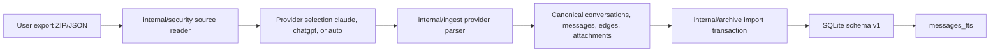
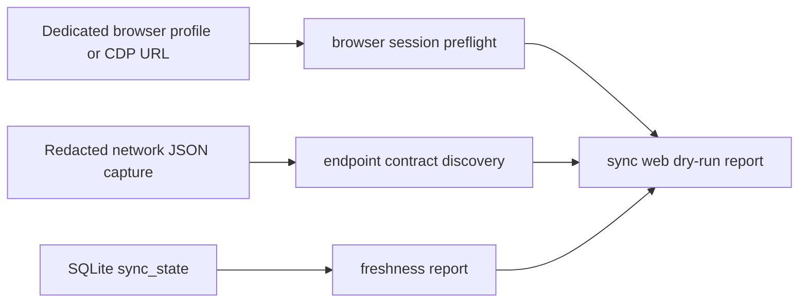
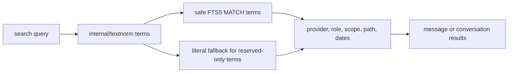

# Architecture

`aicrawl` is a local-first archive for official Claude and ChatGPT conversation exports. The v0.1 product is a CLI that imports local export ZIP/JSON files into SQLite, preserves the original JSON payloads, builds a normalized text index, and exposes read-only retrieval, search, SQL, Markdown export, and CrawlBar metadata.

## User Workflow

1. Request an official export from Claude or ChatGPT.
2. Download the export ZIP and keep it in a private local directory.
3. Run `aicrawl init` to create a private config and SQLite archive.
4. Run `aicrawl import <zip-or-json> --provider claude|chatgpt|auto`.
5. Use `conversations`, `messages`, `search`, `sql`, or `export markdown` against the local archive.
6. Optionally run `aicrawl crawlbar manifest` so CrawlBar can discover the local control surface.

The importer does not delete source exports. Those files still contain private data after import.

## Package Layout

```text
cmd/aicrawl/              CLI entry point
internal/app/             command parsing, runtime paths, JSON/text output, CrawlBar manifest
internal/archive/         SQLite reads/writes, import ledger, sync-state reads, search, read-only SQL, Markdown export
internal/schema/          schema migrations using PRAGMA user_version
internal/ingest/
  claudeexport/           official Claude export parser
  chatgptexport/          official ChatGPT export parser
internal/sync/
  browser/                browser-profile and CDP preflight for web sync
  webdiscover/            redacted network capture contract discovery
  websync/                web sync report model and privacy boundary
internal/security/        ZIP safety, source size guards, private file handling helpers
internal/textnorm/        searchable text normalization and safe FTS query construction
testdata/redacted/        small synthetic fixtures only
```

Provider-specific parsing stays under `internal/ingest/*`. Reusable local archive mechanics come from `github.com/openclaw/crawlkit` where they naturally fit, especially config paths, SQLite store opening, and control payload types.

## Import Flow



The source reader accepts local JSON files and ZIP files with JSON entries. It rejects unsafe ZIP entries such as absolute paths, traversal, and symlinks. Official top-level conversation arrays are streamed so large exports do not have to be buffered as one JSON blob.

Every import is keyed by source kind, provider, and source hash. Re-importing the same file returns the existing ledger row and does not duplicate conversations, messages, edges, attachments, or FTS entries.

## Web Sync Preflight



`aicrawl sync web` is the first browser-profile lane. It validates the intended auth boundary and reports whether a ChatGPT or Claude capture still exposes recognizable conversation list/detail calls. The command is read-only in v0.1: it does not drive a browser, copy auth material, call private product APIs, or write transcripts. It exists to make the contract and freshness state visible before provider-specific live sync adapters are allowed to write into the archive.

The network discovery parser consumes structured JSON captures, walks nested request objects, and emits only sanitized origins and paths. Query strings, fragments, headers, cookies, and authorization values are not included in the report.

## Data Model

The archive stores provider-prefixed stable IDs for conversations and messages. It does not expose SQLite row IDs as stable user-facing IDs.

Raw JSON is preserved in `raw_payload` columns for conversations, messages, message versions, attachments, and accounts where available. Parsed columns are used for listing, filtering, and search. Normalized text is only the searchable projection; it does not replace raw payloads.

ChatGPT exports are treated as a graph. The importer stores every mapping node as a message when possible and stores explicit parent/child edges in `message_edges`. The current path is marked separately so users can choose `--path current` or `--path all`.

Claude exports are parsed defensively. Unknown fields are tolerated and preserved in raw payloads. Missing or malformed optional metadata produces warnings where useful, while missing required stable IDs fail clearly.

## Search Flow



`aicrawl search` defaults to visible current-path content. Visible content includes user, assistant, unknown transcript text, and attachment text. Internal roles such as system, developer, and tool are searchable only when requested with `--scope internal` or `--scope all`.

FTS reserved words and operators such as `AND`, `OR`, `NOT`, `NEAR`, and `*` are handled as user search terms rather than accidental FTS syntax.

## Read And Export Flow

`conversations`, `messages`, `search`, `sql`, `metadata`, `status`, and `doctor` open the archive read-only when they touch the database. `sql` accepts one statement and only allows read-only `SELECT`, `WITH`, and a small allowlist of safe `PRAGMA` statements.

`export markdown` writes private Markdown files with mode `0600` into a directory created with mode `0700` when the directory does not already exist. It can export all conversations, one conversation, date-filtered conversations, or query-filtered conversations.

## Privacy Boundary

`aicrawl` v0.1 imports official local exports and can run read-only web-sync preflight checks. It does not use session-token scraping, browser automation, live private product API transcript writes, cloud sync, embeddings, background watches, or network import/search/export. Import, sync preflight, search, SQL, Markdown export, and CrawlBar manifest generation are local operations.

Private data should stay in ignored local paths such as `imports/private/`, platform runtime directories, SQLite files, logs, and generated Markdown export directories. Public fixtures must be synthetic or redacted.

## CrawlBar And Control Surface

`metadata --json`, `status --json`, and `doctor --json` emit JSON control payloads safe for automation and CrawlBar. `crawlbar manifest` writes a manifest containing command metadata, runtime paths, capabilities, and privacy flags.

The manifest is generated from the current runtime config, so users can override the config path with `AICRAWL_CONFIG` or `--config` before generating it.
