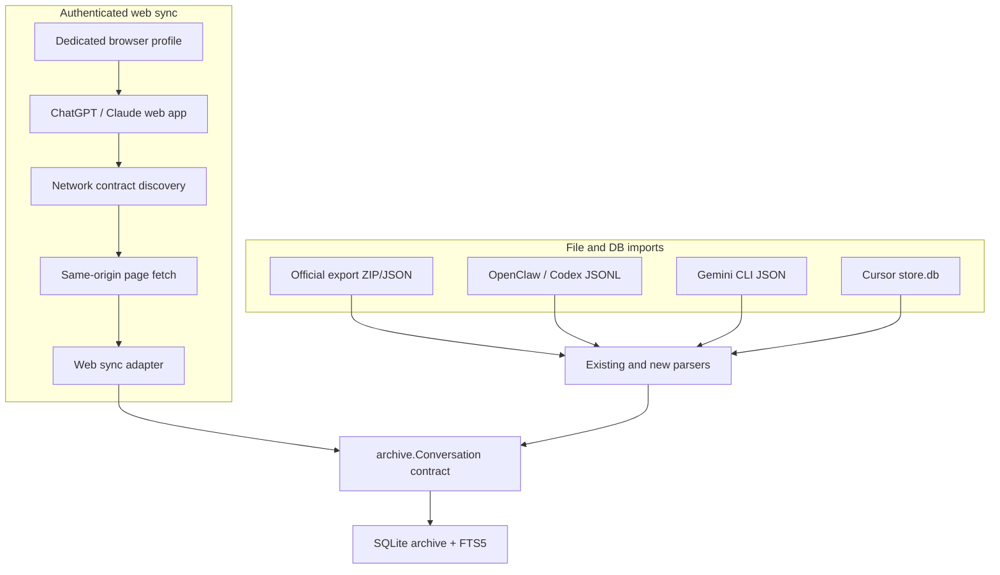

# Local AI Conversation Archive Ingestion

## Summary

Extend `aicrawl` from official Claude and ChatGPT export ingestion into a private local archive for the AI conversation surfaces Jimmy actually uses. ChatGPT and Claude web capture must be first-class frequent sync paths using an authenticated browser profile and the web apps' own same-origin data calls. Official exports become periodic reconciliation, not the main freshness mechanism. Local agent and coding surfaces still import from files and SQLite stores.

---

## Problem Frame

Official exports are too slow for keeping a private AI-chat database current, and much of Jimmy's usage happens in ChatGPT and Claude product surfaces. The archive needs a live capture mechanism that stays inside an already authenticated browser session, preserves raw payloads, keeps IDs stable, supports frequent delta syncs, and keeps raw transcripts separate from promoted memory.

---

## Requirements

### Web And Product Sources

- R1. Sync ChatGPT web conversations through an authenticated browser profile, using same-origin app data calls observed from the live web app.
- R2. Sync Claude web conversations through an authenticated browser profile, using same-origin app data calls observed from the live web app.
- R3. Keep browser authentication inside the browser profile; do not export cookies, bearer tokens, session tokens, or auth headers into config files.
- R4. Use official ChatGPT and Claude exports as periodic reconciliation to fill gaps, detect missing conversations, and validate parser fidelity.

### Local Sources

- R5. Import OpenClaw live and cold archived sessions from JSONL without mutating the OpenClaw session store.
- R6. Import Codex rollout JSONL sessions from both current and archived Codex session roots.
- R7. Import Gemini CLI JSON chat sessions with stable session and message ordering.
- R8. Import Claude Code local history only after its JSONL shape is characterized with redacted fixtures.
- R9. Import Cursor chat databases only after the `blobs` and `meta` table payload contract is characterized with redacted fixtures.

### Archive Behavior

- R10. Preserve raw source payloads alongside normalized searchable text for every imported or synced source.
- R11. Use deterministic provider-prefixed conversation and message IDs so overlapping imports and syncs are idempotent.
- R12. Record source kind, source hash or sync cursor, first import, and last-seen metadata for every import or sync.
- R13. Represent non-linear conversation structure when the source exposes edges or parent IDs; otherwise mark path membership as unknown.
- R14. Track provider freshness so stale ChatGPT/Claude syncs are visible.
- R15. Keep all private fixtures redacted; never commit real transcript content, local archive databases, credentials, copied browser profiles, or generated private Markdown exports.

---

## High-Level Technical Design

Web sync should add a browser-orchestrated acquisition layer in front of the existing archive contracts. The runner should attach to or launch a dedicated browser profile, let Jimmy log in normally, observe conversation-list and conversation-detail calls, and replay only those same-origin calls from page context. It should not read cookies from disk, copy tokens, or persist authentication material outside the browser profile.

---

## Key Technical Decisions

- KTD1. `aicrawl` owns the durable archive: The existing SQLite, raw payload, FTS5, Markdown export, and import ledger machinery remain the archive engine.
- KTD2. Add `sync web` for browser-profile capture: File imports and authenticated web syncs have different lifecycles, so keep `aicrawl import` for files and add a sync command for ChatGPT/Claude web capture.
- KTD3. Use page-context same-origin calls, not copied credentials: Browser auth stays in a dedicated profile and the browser supplies auth automatically.
- KTD4. Discover endpoint contracts before hard-coding adapters: ChatGPT and Claude web APIs are not public stable contracts, so a discovery harness must record redacted request shapes, response schemas, pagination, timestamps, and deletion behavior.
- KTD5. Official exports become reconciliation: Exports are useful for backfill and sanity checks, but they are not the freshness path.
- KTD6. Local adapters stream into `archive.ImportStream`: Large JSONL corpora should not require loading whole sources into memory.
- KTD7. Cursor and Claude Code need characterization gates before durable import code.

---

## Implementation Units

### U1. Provider Registry And Command Surface

- **Goal:** Generalize provider validation, file import dispatch, and web sync dispatch.
- **Files:** `internal/app/app.go`, `internal/archive/types.go`, `docs/COMMANDS.md`, `docs/EXPORTS.md`, `README.md`
- **Patterns:** Follow the existing `importStream` switch in `internal/app/app.go` and parser package shape under `internal/ingest/chatgptexport`.
- **Test Scenarios:**
  - `importProvider` accepts local providers without regressing `auto`, `claude`, or `chatgpt`.
  - `sync web --provider chatgpt|claude` validates providers separately from file import providers.
  - `providerOrAll` allows all archive providers for `conversations`, `search`, and Markdown export filters.
  - Help and docs distinguish official-export providers, web sync providers, and local transcript providers.

### U2. Authenticated Browser Sync Shell

- **Goal:** Build the browser-profile orchestration layer for ChatGPT/Claude syncs without extracting cookies or tokens.
- **Files:** `internal/sync/browser/session.go`, `internal/sync/browser/session_test.go`, `internal/app/app.go`, `docs/ARCHITECTURE.md`, `docs/COMMANDS.md`
- **Patterns:** Use a dedicated profile path or connect to a user-launched browser over CDP. Requests must run from page context after normal interactive login.
- **Test Scenarios:**
  - First-run sync reports `login_required` without treating it as a hard failure.
  - A sync can attach to an already running browser profile through a configured CDP URL.
  - No config writes cookies, bearer tokens, auth headers, or browser storage contents.
  - Dry-run mode lists auth state and candidate counts without storing message text.

### U3. Web API Discovery Harness

- **Goal:** Capture the current ChatGPT and Claude web data contracts before building provider-specific sync adapters.
- **Files:** `internal/sync/webdiscover/discover.go`, `internal/sync/webdiscover/discover_test.go`, `docs/research/chatgpt-web-sync-contract.md`, `docs/research/claude-web-sync-contract.md`
- **Patterns:** Observe network requests while loading conversation lists and opening conversations; store only redacted endpoint shapes, response key paths, pagination behavior, and ID/timestamp fields.
- **Test Scenarios:**
  - Discovery records method, URL pattern, status class, pagination hints, and redacted schema keys.
  - Discovery output excludes message bodies and auth material.
  - The harness distinguishes list endpoints from conversation-detail endpoints.
  - A changed endpoint shape marks the provider contract as stale and blocks normal sync.

### U4. ChatGPT Web Sync Adapter

- **Goal:** Sync ChatGPT web conversation list/detail payloads through browser page context and convert them into `archive.Conversation` rows.
- **Files:** `internal/sync/chatgptweb/sync.go`, `internal/sync/chatgptweb/sync_test.go`, `testdata/redacted/chatgpt-web-list.fixture.json`, `testdata/redacted/chatgpt-web-conversation.fixture.json`
- **Patterns:** Reuse ChatGPT export graph handling where possible, but do not assume web payloads match `conversations.json`.
- **Test Scenarios:**
  - List sync discovers new and recently updated conversations since the last cursor.
  - Detail sync imports a conversation with branches when parent/child structure is exposed.
  - Deleted, archived, or inaccessible conversations are marked inaccessible/stale without destructive deletion.
  - Official export import for the same conversation reconciles without duplicating messages.

### U5. Claude Web Sync Adapter

- **Goal:** Sync Claude web conversation list/detail payloads through browser page context and convert them into `archive.Conversation` rows.
- **Files:** `internal/sync/claudeweb/sync.go`, `internal/sync/claudeweb/sync_test.go`, `testdata/redacted/claude-web-list.fixture.json`, `testdata/redacted/claude-web-conversation.fixture.json`
- **Patterns:** Treat project/workspace metadata as optional metadata; do not assume official export shape preserves branch/path information.
- **Test Scenarios:**
  - List sync discovers new and recently updated conversations since the last cursor.
  - Detail sync imports user and assistant turns in deterministic order.
  - Project/workspace metadata is preserved when present.
  - Missing branch metadata marks path membership unknown rather than fabricating edges.

### U6. Official Export Reconciliation

- **Goal:** Keep official exports as a slower integrity pass that backfills missed conversations and validates web sync fidelity.
- **Files:** `internal/archive/reconcile.go`, `internal/archive/reconcile_test.go`, `internal/ingest/chatgptexport/parse_test.go`, `internal/ingest/claudeexport/parse_test.go`, `docs/EXPORTS.md`
- **Patterns:** Use deterministic IDs and message content hashes to compare official export rows with web-synced rows.
- **Test Scenarios:**
  - Importing an official export after web sync fills missing messages without duplicating known messages.
  - Divergent payloads produce bounded reconciliation warnings instead of overwriting raw web payloads silently.
  - Reconciliation reports provider coverage and last freshness by source kind.

### U7. Local Transcript Adapters

- **Goal:** Add file and SQLite adapters for OpenClaw, Codex, Gemini CLI, Claude Code, and Cursor.
- **Files:** `internal/ingest/openclawjsonl/parse.go`, `internal/ingest/codexjsonl/parse.go`, `internal/ingest/geminicli/parse.go`, `internal/ingest/claudecode/parse.go`, `internal/ingest/cursorstore/parse.go`, matching `*_test.go` files, redacted fixtures under `testdata/redacted/`
- **Patterns:** Stream JSONL where possible, preserve raw payloads, and warn without private text when records cannot be mapped.
- **Test Scenarios:**
  - Each adapter imports one redacted fixture as ordered messages.
  - Unknown records produce bounded warnings without logging private text.
  - Re-importing the same source does not duplicate conversations or messages.
  - Cursor fixtures are opened read-only.

### U8. Source Audit, Freshness, And Privacy Guardrails

- **Goal:** Add dry-run/source-audit and freshness reporting for imports and web syncs.
- **Files:** `internal/app/app.go`, `internal/app/json.go`, `internal/ingest/localinspect/inspect.go`, `internal/sync/status.go`, `docs/COMMANDS.md`, `docs/ARCHITECTURE.md`, `.gitignore`, `testdata/redacted/README.md`
- **Patterns:** Mirror existing JSON output conventions in `status`, `doctor`, and `metadata`; never include message bodies in audit output.
- **Test Scenarios:**
  - `aicrawl import <dir> --provider openclaw --dry-run --json` reports candidates without writing the archive.
  - `aicrawl sync web --provider chatgpt --dry-run --json` reports auth state, endpoint-contract state, candidate counts, and freshness without storing messages.
  - `.gitignore` excludes local archive DBs, private imports, copied browser profiles, endpoint captures with private payloads, copied Cursor stores, and generated Markdown exports.

---

## Acceptance Examples

- AE1. Given Jimmy is logged into ChatGPT in the dedicated browser profile, when `aicrawl sync web --provider chatgpt` runs, then new and recently updated conversations are imported without requesting an official export.
- AE2. Given Jimmy is logged into Claude in the dedicated browser profile, when `aicrawl sync web --provider claude` runs, then new and recently updated conversations are imported without requesting an official export.
- AE3. Given the web endpoint contract has changed, when sync runs, then it fails with `contract_stale` and leaves the existing archive untouched.
- AE4. Given an OpenClaw session JSONL fixture with user and assistant turns, when it is imported with `--provider openclaw`, then `aicrawl search` finds the visible text.
- AE5. Given a ChatGPT official export arrives after several web syncs, when reconciliation runs, then missed export-only messages are added and known web-synced messages are not duplicated.

---

## Scope Boundaries

- Deferred for later: browser extension packaging, embeddings/semantic search, automated official export download, cross-device mobile capture, and Hermes VM log ingestion.
- Outside this project identity: cookie/token extraction, storing auth headers, bypassing login or access controls, browser automation that clicks export buttons, copying broad private assistant context onto the VM, and using the archive as accepted long-term memory.

---

## Risks And Dependencies

- **Web API drift:** ChatGPT and Claude web calls are not public stable APIs. Mitigation: discovery harness, redacted contract docs, contract-stale failures, and official export reconciliation.
- **Authentication leakage:** Browser sync could tempt token handling. Mitigation: same-origin page-context requests only, dedicated browser profile, no credential persistence outside browser storage, and tests that assert configs do not contain auth material.
- **Source format drift:** Codex, Gemini CLI, Claude Code, and Cursor local stores can change without warning. Mitigation: fixture-based parser tests, dry-run warnings, and source-specific adapters.
- **Private data leakage:** Real transcripts are sensitive. Mitigation: redacted fixtures only, ignored private roots, JSON audit output without message text, and release checks.
- **False completeness:** Product UI chats can still be missed if sync is blocked, logged out, rate-limited, or endpoint contracts drift. Mitigation: status output should report freshness, auth state, and contract state.
